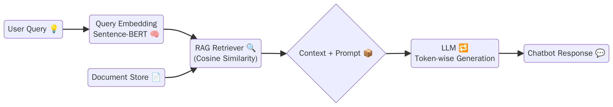

# OncoQA-Bot: AI-Powered Q&A Chatbot for HER2-Positive Breast Cancer

> A generative AI chatbot leveraging **clinical NLP embeddings** and **retrieval-augmented generation (RAG)** to answer oncology-related questions with precision.

---

## 📌 Overview

This chatbot was designed to answer queries related to HER2-positive breast cancer, grounded in the landmark publication  
*"Human Breast Cancer: Correlation of Relapse and Survival with Amplification of the HER-2/neu Oncogene"* (Slamon et al., 1987).

It integrates **unified clinical vocabulary embeddings** (based on biomedical research from "Unified Clinical Vocabulary Embeddings for Advancing Precision Medicine") to improve the **semantic relevance** and **accuracy** of responses.

---

## 🔬 Key Features

- 🧠 **Clinical Embedding Search** using cosine similarity for semantically relevant answer retrieval
- 🧾 Based on **validated HER2 medical literature** and clinical ontologies
- 🤖 Combines **RAG pipeline** with **LLM generation** for contextual answers
- 📈 **Evaluated** using BLEU, ROUGE, and manual expert review

---

## 🛠️ Tech Stack

- **Transformers** (GPT-Neo 125M)
- **Sentence-BERT** for embeddings
- **Scikit-learn** for similarity computation
- **Fitz (PyMuPDF)** for PDF parsing
- **Pandas, NumPy, Pickle**, Regex, Requests

---

## 📊 Architecture

---

## 🧪 Evaluation Metrics

- ✅ **Response Accuracy** (BLEU, ROUGE, expert review)
- ⚡ **Real-time Response Speed**
- 👍 **User Satisfaction** (manual testing & feedback)

---

## 💬 Example

**User:** _"What does HER2-positive mean in breast cancer?"_

**Bot:** _"HER2-positive breast cancer means the cancer cells have more HER2 receptors than normal. This type of cancer tends to grow faster but responds well to targeted therapies."_

---

